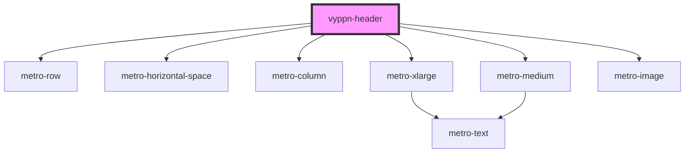

# vyppn-header

<!-- Auto Generated Below -->

## Properties

| Property     | Attribute     | Description | Type     | Default     |
| ------------ | ------------- | ----------- | -------- | ----------- |
| `errorImage` | `error-image` |             | `string` | `undefined` |
| `source`     | `source`      |             | `string` | `undefined` |

## Dependencies

### Depends on

- metro-row
- metro-horizontal-space
- metro-column
- metro-xlarge
- metro-medium
- metro-image

### Graph

----------------------------------------------

*Built with [StencilJS](https://stenciljs.com/)*
