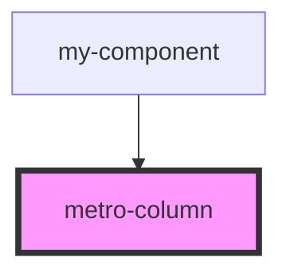

# metro-column

<!-- Auto Generated Below -->

## Properties

| Property  | Attribute | Description | Type               | Default     |
| --------- | --------- | ----------- | ------------------ | ----------- |
| `align`   | `align`   |             | `string`           | `undefined` |
| `justify` | `justify` |             | `string`           | `undefined` |
| `padding` | `padding` |             | `number \| string` | `undefined` |

## Dependencies

### Used by

 - [my-component](../my-component)

### Graph

----------------------------------------------

*Built with [StencilJS](https://stenciljs.com/)*
