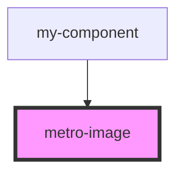

# metro-image

<!-- Auto Generated Below -->

## Properties

| Property     | Attribute     | Description | Type               | Default     |
| ------------ | ------------- | ----------- | ------------------ | ----------- |
| `errorImage` | `error-image` |             | `string`           | `undefined` |
| `height`     | `height`      |             | `number \| string` | `undefined` |
| `source`     | `source`      |             | `string`           | `undefined` |
| `width`      | `width`       |             | `number \| string` | `undefined` |

## Dependencies

### Used by

 - [my-component](../my-component)

### Graph

----------------------------------------------

*Built with [StencilJS](https://stenciljs.com/)*
