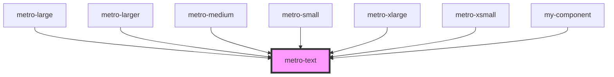

# metro-text

<!-- Auto Generated Below -->

## Dependencies

### Used by

 - [metro-large](../metro-large)
 - [metro-larger](../metro-larger)
 - [metro-medium](../metro-medium)
 - [metro-small](../metro-small)
 - [metro-xlarge](../metro-xlarge)
 - [metro-xsmall](../metro-xsmall)
 - [my-component](../my-component)

### Graph

----------------------------------------------

*Built with [StencilJS](https://stenciljs.com/)*
