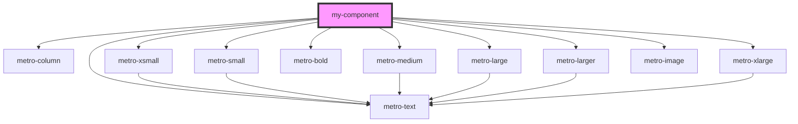

# my-component

<!-- Auto Generated Below -->

## Dependencies

### Depends on

- [metro-column](../metro-column)
- [metro-xsmall](../metro-xsmall)
- [metro-small](../metro-small)
- [metro-medium](../metro-medium)
- [metro-text](../metro-text)
- [metro-bold](../metro-bold)
- [metro-large](../metro-large)
- [metro-larger](../metro-larger)
- [metro-xlarge](../metro-xlarge)
- [metro-image](../metro-image)

### Graph

----------------------------------------------

*Built with [StencilJS](https://stenciljs.com/)*
